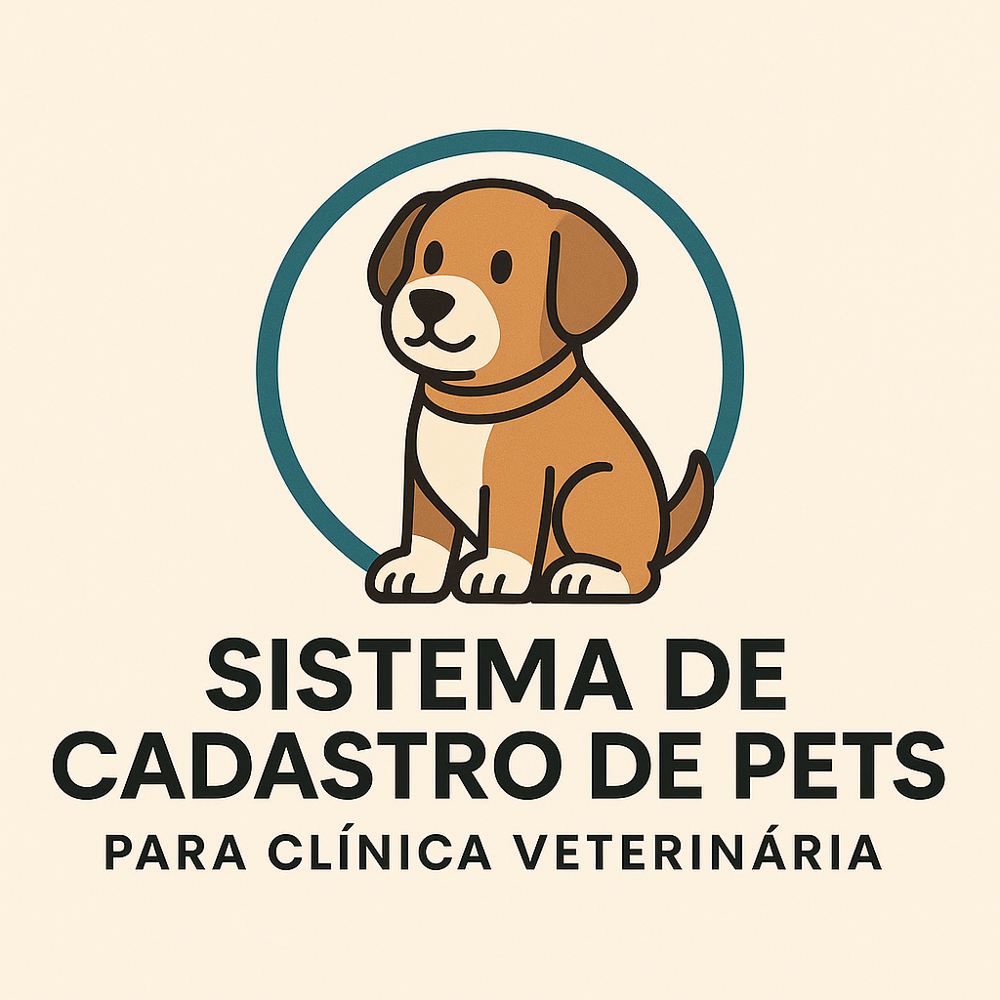

# Sistema para Clínica Veterinária



[](https://choosealicense.com/licenses/mit/)

[](https://laravel.com/)


Um sistema simples e fácil de usar, feito para clínicas que cuidam com carinho dos pets e dos donos.

---

## Sobre

Este é um sistema pequeno e direto para gerenciar pets. Foi feito com Laravel e é ótimo para clínicas veterinárias que querem registrar informações de clientes, animais e atendimentos de forma rápida e organizada.

---

## O que o sistema faz

* Cadastro de clientes com nome, telefone, e-mail, CPF, endereço e mais
* Cadastro de pets com nome, idade, espécie, raça, peso, etc.
* Registro de atendimentos com data, descrição do serviço e observações
* Ligação de pets com seus respectivos donos
* Histórico de atendimentos e agendamentos

---

## Como instalar o sistema

Antes de começar, você vai precisar de:

* PHP 8.4 ou mais recente
* Docker
* Composer
* Node.js e NPM
* Laravel Sail

### 1. Baixe o projeto

```bash
git clone https://github.com/CarlosESantosSousa/petshop.git
cd petshop
```

### 2. Instale os pacotes necessários

```bash
composer install
npm install
cp .env.example .env
```

### 3. Gere a chave do sistema

```bash
php artisan key:generate
```

### 4. Inicie o ambiente com o Sail

```bash
./vendor/bin/sail up -d
```

### 5. Configure o banco de dados no arquivo `.env`

```env
DB_CONNECTION=mysql
DB_HOST=127.0.0.1
DB_PORT=3306
DB_DATABASE=nome_do_banco
DB_USERNAME=root
DB_PASSWORD=
```

### 6. Rode as migrations

```bash
php artisan migrate
```

### 7. Crie um usuário para acessar o painel de administração

```bash
php artisan make:filament-user
```

### 8. (Opcional) Adicione dados de exemplo no sistema

```bash
php artisan db:seed
```

### 9. Acesse o sistema no navegador

```
http://localhost
```

---

## Agradecimentos

Esse sistema foi criado pensando nas necessidades reais de clínicas veterinárias. Agradecemos à comunidade Laravel e a todos que criaram as ferramentas usadas no projeto.

---

## Contato

Participantes do projeto:

* Rickelmy Carvalho
* João Paulo
* Gabriel